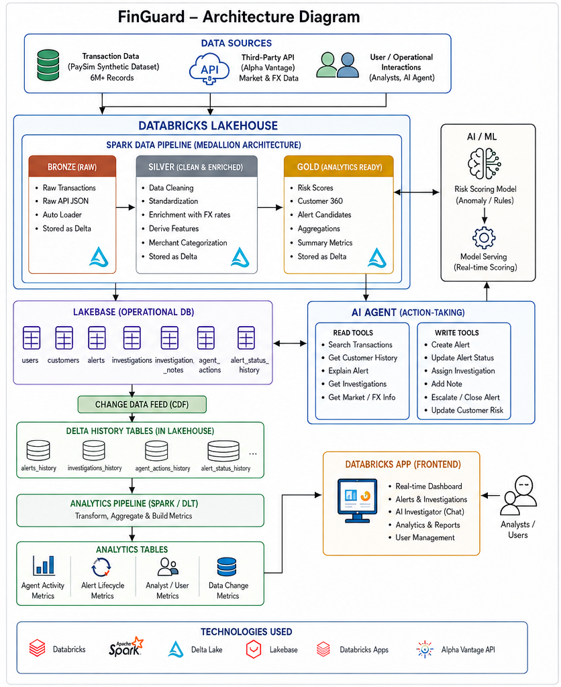

# FinGuard — Real-Time Financial Transaction Intelligence & AI Investigation Platform

FinGuard is an end-to-end Databricks capstone that ingests financial transactions, applies data-quality and FX enrichment, scores transaction risk, creates operational fraud alerts in Lakebase, supports AI-assisted investigations through a Databricks App, and feeds operational changes back into Gold analytics through CDC.



## Validated Capstone Results

The completed project run validated the following results:

| Metric | Result |
| --- | ---: |
| PaySim Bronze rows | 6,362,620 |
| Unique Bronze transactions | 6,362,620 |
| Valid Silver transactions | 6,362,604 |
| Quarantined records | 16 |
| Gold risk-scored transactions | 6,362,604 |
| Alert candidates at score >= 50 | 3,021 |
| Lakebase OPEN alerts initially created | 3,021 |
| Alpha Vantage current FX pairs | USD/EUR, USD/GBP, USD/JPY |
| Demo alert escalations captured by CDC | 1 |
| Demo alert resolutions captured by CDC | 1 |
| AI agent actions captured | 6 |
| Agent action success rate in validated demo | 100% |

## Architecture

FinGuard uses the following flow:

```text
PaySim + Alpha Vantage
        |
        v
Bronze Delta
        |
        v
Silver DQ + FX + Behavioral Features
        |
        v
Gold Risk Scoring
        |
        v
Lakebase Operational Alerts
        |
        +--> Databricks App --> AI Investigator
        |         |                 |
        |         +--> Analyst actions / notes / status changes
        |                           |
        +---------------------------+
        |
        v
Lakebase CDC
        |
        v
Gold Operational Analytics
```

Core technologies include Apache Spark, Delta Lake, Unity Catalog, Structured Streaming, Lakebase PostgreSQL, Databricks Apps, Databricks Foundation Model APIs, OAuth database credentials, CDC, Streamlit, and Alpha Vantage.

## Risk Scoring

The deterministic score combines the implemented rules:

- Amount at least 3x the customer average: +30
- Multiple transactions in a short window: +20
- New destination/account: +15
- Unusual transaction type: +15
- International transaction: +10
- High-value transaction: +10

Risk bands remain:

```text
0-29    LOW
30-59   MEDIUM
60-79   HIGH
80-100  CRITICAL
```

For the capstone demonstration, the configurable alert threshold is **50**, so high-MEDIUM transactions can enter the investigation workflow while their risk level remains MEDIUM. A production deployment can raise the alert threshold without changing the scoring model.

## Databricks Workspace Layout

The notebooks derive the logged-in user prefix dynamically. For the validated run:

```text
Catalog:             bootcamp_students
Bronze schema:       premetl9_bronze
Silver schema:       premetl9_silver
Gold schema:         premetl9_gold
Operations schema:   premetl9_operations
CDC schema:          premetl9_lakebase_cdc
```

The Bronze PaySim source volume is:

```text
/Volumes/bootcamp_students/premetl9_bronze/raw/paysim
```

## Lakebase

Validated Lakebase configuration:

```text
Project:   FinGuard-Lakebase
Branch:    production
Database:  databricks_postgres
Schema:    premetl9
```

Operational tables:

```text
premetl9.users
premetl9.customers
premetl9.fraud_alerts
premetl9.investigations
premetl9.investigation_notes
premetl9.agent_actions
premetl9.alert_status_history
```

The operational tables used for CDC have `REPLICA IDENTITY FULL` enabled where required.

## Databricks App

The repository root is deployed as the Databricks App source. The root `app.yaml` starts Streamlit and maps two Databricks App resources:

- Lakebase database resource key: `postgres`
- Model serving endpoint resource key: `llm`

The App uses Databricks authentication first, then the FinGuard welcome screen verifies the entered username against the authenticated identity. Authorization roles are stored in `premetl9.users` and include `ANALYST`, `SENIOR_ANALYST`, and `ADMIN`.

The app provides:

- Dashboard metrics and highest-risk alerts
- Alert investigation queue and alert details
- Investigation history and notes
- AI Investigator chat
- Audited assignment, investigation, note, escalation, and resolution actions
- Explicit confirmation for high-impact actions

## AI Investigator Safety Controls

The AI Investigator:

- Uses only an allowlisted set of FinGuard tools
- Is instructed not to invent transaction, customer, or market data
- Does not generate arbitrary SQL
- Uses cached Silver FX data instead of calling a third-party API from chat
- Requires explicit analyst confirmation before escalation or resolution
- Records write actions in `agent_actions`
- Records alert lifecycle changes in `alert_status_history`

The Databricks App uses its service-principal OAuth identity for model access. Lakebase database credentials are generated as short-lived OAuth credentials at runtime; passwords and OAuth tokens must never be committed to Git.

## Execution Order

1. Run `sql/create_delta_tables.sql`.
2. Upload PaySim under the user-specific Bronze raw volume.
3. Run `notebooks/01_bronze_ingestion.py`.
4. Configure the Alpha Vantage secret and run `notebooks/04_fx_api_ingestion.py`.
5. Run `notebooks/02_silver_transformations.py`.
6. Run `notebooks/03_gold_risk_scoring.py`.
7. Create the Lakebase operational schema with `sql/create_lakebase_tables.sql`.
8. Configure Lakebase runtime connection values and run `notebooks/05_streaming_risk_alerts.py`.
9. Configure Lakebase CDC and run `notebooks/06_cdc_analytics.py`.
10. Deploy the repository root as the Databricks App.
11. Add the Lakebase `postgres` resource and the model endpoint `llm` resource.
12. Grant the App service principal access to the existing Lakebase schema/tables.
13. Register authorized application users in `premetl9.users`.

## Notebook 05 Lakebase Configuration

Notebook 05 no longer contains database credentials. Before running it, provide the Lakebase connection metadata using environment variables or Spark configuration. For example:

```python
spark.conf.set("finguard.lakebase.host", "<lakebase-host>")
spark.conf.set(
    "finguard.lakebase.endpoint",
    "projects/<project-id>/branches/<branch-id>/endpoints/<endpoint-id>",
)
```

The notebook uses the Databricks SDK to generate a short-lived OAuth database credential at runtime.

## Repository Layout

```text
.
├── agent/                  # AI orchestration and allowlisted tools
├── app/                    # Streamlit UI and app services
├── config/                 # Non-secret example configuration
├── docs/                   # Architecture and project documentation
├── notebooks/              # Databricks notebook-source pipelines 01-06
├── sql/                    # Delta, Lakebase, and analytics SQL
├── src/finguard/           # Reusable Python services
├── tests/                  # Unit tests
├── app.yaml                # Databricks App entry point/resources
├── requirements.txt
└── README.md
```

## Demo Flow

A concise end-to-end demo is:

```text
Login
  -> Dashboard (3,021 alerts)
  -> Select an alert
  -> Review risk score and reasons
  -> Create investigation with AI
  -> Add investigation note
  -> Assign alert
  -> Confirm and escalate
  -> Confirm and resolve
  -> Show agent_actions and alert_status_history
  -> Run CDC analytics
  -> Show updated Gold alert summary
```

## Security and Secrets

Do not commit credentials. The project expects secrets and short-lived credentials to be supplied through Databricks secret scopes, Databricks App resources, OAuth, or runtime configuration.

The Alpha Vantage API key is stored outside source control. The Databricks App does not require a personal access token for AI model calls.


## Automation

FinGuard includes a Declarative Automation Bundle in `databricks.yml` and an automated validation notebook in `notebooks/07_pipeline_validation.py`.

The bundle defines three Lakeflow Jobs:

- **FinGuard - Main Transaction Pipeline**: Bronze ingestion and FX refresh run first, Silver waits for both, then Gold scoring, Lakebase alert writing, and automated validation run in sequence.
- **FinGuard - FX Refresh**: refreshes USD/EUR, USD/GBP, and USD/JPY every six hours.
- **FinGuard - CDC Analytics Refresh**: refreshes Lakebase CDC operational analytics every five minutes.

The schedules are intentionally committed as `PAUSED` so cloning or deploying the repository does not immediately create recurring compute usage. After configuring `lakebase_endpoint`, validate and deploy the bundle, test each job once, and then unpause the schedules in the Databricks Jobs UI or change `pause_status` to `UNPAUSED`.

The main pipeline requires the full Lakebase endpoint resource name in this format:

```text
projects/<project-id>/branches/<branch-id>/endpoints/<endpoint-id>
```

Set that value for the `lakebase_endpoint` bundle variable before running the main pipeline.

Typical bundle commands are:

```bash
databricks bundle validate
databricks bundle deploy
databricks bundle run finguard_main_pipeline
databricks bundle run finguard_fx_refresh
databricks bundle run finguard_cdc_analytics
```

The validation notebook writes an audit history to:

```text
bootcamp_students.<username>_operations.pipeline_validation_results
```

It checks table availability, Bronze/Silver/quarantine reconciliation, transaction-ID uniqueness, Gold row reconciliation, risk-band mapping, alert-threshold mapping, required FX pairs, CDC history tables, Gold operational summary rows, and the agent-action success-rate range. Any failed required check raises an exception so the Lakeflow Job fails visibly.

## Documentation

- [Architecture details](docs/architecture.md)
- [Implementation details](docs/implementation_details.md)
- [Project setup](docs/project_setup.md)
- [Capstone project document (PDF)](docs/FinGuard_Capstone_Project_Document.pdf)

## Development

```bash
python -m venv .venv
.venv\Scripts\activate
pip install -r requirements.txt
pytest
```

The project is configuration-driven so the same code can be adapted to another Databricks user, schema prefix, Lakebase project, or model endpoint without committing secrets.
